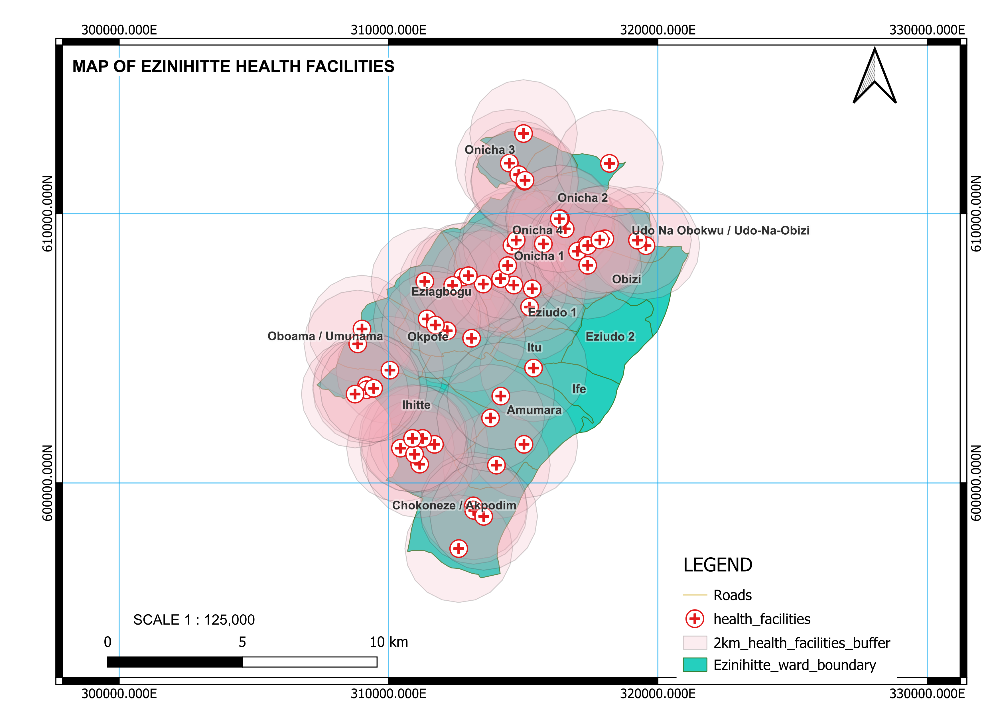

# GeoDev-Lab
This project uses GIS to map and assess healthcare accessibility in Ezinihitte Mbaise LGA, identifying wards located more than 2 km from health facilities. It provides spatial insights to support better healthcare planning and service delivery.

## What we covered in Month 1
- [Week 1: Project-brief](Project-brief.md)
- [Week 2: Data-notes](data-notes.md)
- [Week 3: Data-preparation](data-preparation.md)
- [Week 4: month-1-summary](Month1-summary.md)

## Study Area Map

## Month 2: Development environment and early python
- Week 5: Set up PYTHON, VS Code and the terminal. `hello.py` runs
